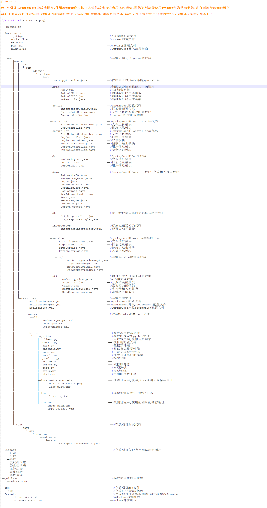

# iDoctor

## 本项目以SpringBoot为后端框架,使用swagger作为接口文档供后端与快应用之间通信,图像识别部分使用pytorch作为基础框架,含有训练好的demo模型

### 下面是项目目录结构,为保证查看清晰,特上传结构的图片解释,如需查看文本,请将文件下载后使用合适的IDE(ex.VSCode)或者记事本打开

│  Readme.md
│
├─Java Maven
│  │  .gitignore                                                ——>Git忽略配置文件
│  │  Dockerfile                                                ——>Docker部署文件
│  │  HELP.md
│  │  pom.xml                                                   ——>Maven包管理文件
│  │  README.md                                                 ——>SpringBoot导入部署指南
│  │
│  │
│  └─src                                                        ——>存放后端SpringBoot源代码
│      ├─main
│      │  ├─java
│      │  │  └─com
│      │  │      └─idoctor
│      │  │          └─software
│      │  │              └─skin
│      │  │                  │  SkinApplication.java            ——>程序主入口,运行环境为Java1.8+
│      │  │                  │
│      │  │                  ├─APIs                             ——>辅助加密随机验证接口函数库
│      │  │                  │      MD5.java                    ——>MD5加密函数
│      │  │                  │      TokenHS256.java             ——>随机验证码生成函数
│      │  │                  │      TokenRS256.java             ——>随机验证码生成函数
│      │  │                  │      TokenUtils.java             ——>随机验证码生成函数
│      │  │                  │
│      │  │                  ├─config                           ——>SpringBoot配置代码
│      │  │                  │      InterceptorConfig.java      ——>拦截器配置代码
│      │  │                  │      StaticPathConfig.java       ——>文件上传静态路径配置代码
│      │  │                  │      SwaggerConfig.java          ——>swagger相关配置代码
│      │  │                  │
│      │  │                  ├─controller                       ——>SpringBoot的Controller层代码
│      │  │                  │      FileUploadController.java   ——>文件上传模块
│      │  │                  │      LogController.java          ——>日志记录模块
│      │  │                  │      LoginController.java        ——>登录模块
│      │  │                  │      NewsController.java         ——>健康小贴士模块
│      │  │                  │      PersonController.java       ——>用户信息模块
│      │  │                  │      XTokenController.java       ——>安全认证模块
│      │  │                  │
│      │  │                  ├─dao                              ——>SpringBoot的Dao层代码
│      │  │                  │      AuthorityDao.java           ——>安全认证模块
│      │  │                  │      LogDao.java                 ——>日志记录模块
│      │  │                  │      PersonDao.java              ——>用户信息模块
│      │  │                  │
│      │  │                  ├─domain                           ——>SpringBoot的Domain层代码,存放相关接口代码
│      │  │                  │      AuthorityDO.java
│      │  │                  │      IntegerRequest.java
│      │  │                  │      LogDO.java
│      │  │                  │      LoginFeedBack.java
│      │  │                  │      LoginRequest.java
│      │  │                  │      LogRequest.java
│      │  │                  │      NewAdministrater.java
│      │  │                  │      News.java
│      │  │                  │      NewsExample.java
│      │  │                  │      PersonDO.java
│      │  │                  │      PersonRequest.java
│      │  │                  │
│      │  │                  ├─dto                              ——>统一HTTP接口返回信息格式相关代码
│      │  │                  │      HttpResponseList.java
│      │  │                  │      HttpResponseSingle.java
│      │  │                  │
│      │  │                  ├─interceptor                      ——>存放拦截器相关代码
│      │  │                  │      InterfaceInterceptor.java   ——>配置启动拦截器
│      │  │                  │
│      │  │                  │
│      │  │                  ├─service                          ——>SpringBoot的Service层接口代码
│      │  │                  │  │  AuthorityService.java        ——>安全认证模块
│      │  │                  │  │  LogService.java              ——>日志记录模块
│      │  │                  │  │  NewsService.java             ——>健康小贴士模块
│      │  │                  │  │  PersonService.java           ——>人员信息模块
│      │  │                  │  │
│      │  │                  │  └─impl                          ——>存放Service层填充代码
│      │  │                  │          AuthorityServiceImpl.java
│      │  │                  │          LogServiceImpl.java
│      │  │                  │          NewsServiceImpl.java
│      │  │                  │          PersonServiceImpl.java
│      │  │                  │
│      │  │                  └─util                             ——>项目相关外部库工具函数类
│      │  │                          MD5Encryption.java         ——>MD5相关函数类
│      │  │                          PageUtils.java             ——>分页相关函数类
│      │  │                          Query.java                 ——>查询相关函数类
│      │  │                          SnowflakeIdWorker.java     ——>序列号相关函数类
│      │  │                          UsedConstants.java         ——>常量相关函数类
│      │  │
│      │  └─resources                                           ——>存放资源文件
│      │      │  application-dev.yml                            ——>SpringBoot配置文件
│      │      │  application-pro.yml                            ——>SpringBoot开发development配置文件
│      │      │  application.yml                                ——>SpringBoot产品production配置文件
│      │      │
│      │      ├─mapper                                          ——>存放Mybatis的Mapper文件
│      │      │  └─skin
│      │      │          AuthorityMapper.xml
│      │      │          LogMapper.xml
│      │      │          PersonMapper.xml
│      │      │
│      │      └─static                                           ——>存放项目静态文件
│      │          └─recognition                                  ——>存放图像识别python文件
│      │              │  client.py                               ——>用户客户端,模拟用户请求
│      │              │  CONFIG.py                               ——>项目用配置文件
│      │              │  data.py                                 ——>数据预处理
│      │              │  ensemble.py                             ——>测试集成模型性能
│      │              │  model.py                                ——>自定义模型MFFNet
│      │              │  models.py                               ——>加载预训练好的模型
│      │              │  predict.py                              ——>模型预测
│      │              │  README.md                               ——>
│      │              │  server.py                               ——>模拟服务器
│      │              │  test.py                                 ——>模型测试
│      │              │  train.py                                ——>模型训练
│      │              │  utils.py                                ——>常用的函数工具
│      │              │
│      │              ├─intermediate_models                      ——>训练过程中,模型,loss的图片的保存地址
│      │              │      confusion_matrix.png
│      │              │      loss_plot.png
│      │              │
│      │              ├─logs                                     ——>模型训练过程中的程序日志
│      │              │      loss_log.txt
│      │              │
│      │              ├─predict                                  ——>预测过程中,使用的图片的储存地址
│      │                    image_path.txt
│      │                    ISIC_0024306.jpg
│      │              
│      │              
│      │
│      │
│      └─test                                                     ——>存放项目测试代码
│          └─java
│              └─com
│                  └─idoctor
│                      └─software
│                          └─skin
│                                  SkinApplicationTests.java
│
│─Pictest                                                         ——>存放项目各种类型测试用例图片
│  ├─正常
│  ├─水痘
│  ├─湿疹
│  ├─皮肤纤维瘤
│  ├─蚕食性溃疡
│  ├─血管病变
│  ├─表皮鳞状
│  └─黑色素痣
├─QuickAPP                                                       ——>存放项目快应用代码
│  └─quick-idoctor
│    
├─rpk                                                             ——>存放项目rpk文件
├─Flask                                                           ——>存放flask后端代码
└─Scripts                                                         ——>存放项目部署脚本代码,运行环境需要maven
        linux_start.sh                                            ——>Windows部署脚本
        windows_start.bat                                         ——>Linux部署脚本
